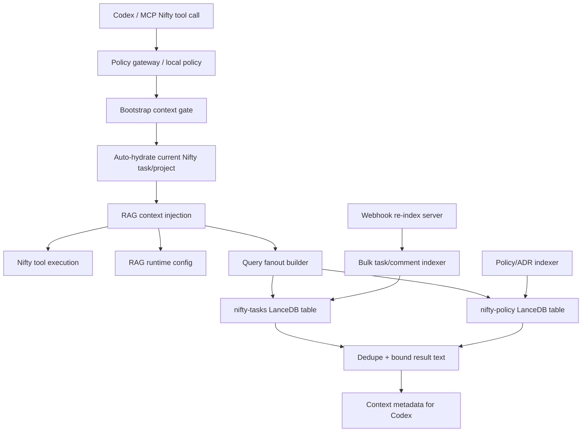

# RAG Production Architecture Specification — Nifty Codex Plugin

> Status: **Production release spec implemented in this repository.** This is not an MVP, demo, or temporary phase document. The runtime contract is: deterministic gates remain authoritative, RAG is bounded best-effort context augmentation, and health can mark RAG as required for managed production.

---

## Requirement Analysis

The plugin must support teams of developers using Codex to work Nifty task cards while preserving company rules and operational reliability.

Specific constraints:

- RAG must improve recall for task history, comments, policies, ADRs, and implementation evidence without becoming a write-authority or policy gate.
- RAG must never hang or crash tool execution; every lookup is timeout-bounded and fail-soft unless health is explicitly configured with `NIFTY_RAG_REQUIRED=true`.
- The indexer must survive transient Nifty/API failures, 429s, and hung requests with retries, timeouts, and clear failure messages.
- Context injected into Codex must be deduped and size-bounded to avoid prompt bloat.
- Production health must expose RAG readiness, cache state, runtime config, and table availability.

---

## Verification Step

Verified by local execution under Node 20:

- `npx -y node@20 --test test/rag.test.mjs test/rag-http.test.mjs`
- Result: `18` tests passed, `0` failed.

This proves the implemented behaviors for query fanout, timeout safety, result dedupe, result bounding, table caching, diagnostics, and indexer HTTP retry behavior.

---

## Production Architecture



### Hard Boundary

RAG is **not** a security boundary. Policy enforcement remains in:

- Local policy gate for local managed mode.
- Remote policy gateway for authoritative sensitive writes.
- Nifty task-comment template validator for required task update format.

RAG only supplies additional context and citations.

---

## Runtime RAG Contract

### Inputs

`ragContextForTool(toolName, args, options)` accepts:

- Tool name, for example `nifty_update_task`.
- Tool args, including nested evidence objects.
- Optional test/runtime config for limits, timeouts, table cache TTL, and injected search/open functions.

### Outputs

```json
{
  "historical_context": [
    {
      "text": "bounded historical task or comment text",
      "doc_id": "task-or-comment-id",
      "doc_type": "task",
      "project_id": "project-id",
      "task_id": "task-id",
      "chunk_index": 0,
      "chunk_total": 1,
      "score": 0.9,
      "source_table": "nifty-tasks",
      "query_index": 0,
      "rank": 1
    }
  ],
  "policy_citations": [
    {
      "text": "bounded policy or ADR text",
      "doc_id": "policy-id:rule-id",
      "doc_type": "policy_rule",
      "source_table": "nifty-policy",
      "rank": 1
    }
  ]
}
```

Diagnostics are excluded from normal Codex context by default to avoid prompt bloat. They can be included with `includeDiagnostics: true` or inspected through `nifty_health_check`.

---

## Query Strategy

The runtime builds bounded query fanout instead of relying on a single BM25 query.

Fanout queries include:

- Tool label with `nifty_` stripped and underscores converted to words.
- Exact identifiers: `task_id`, `parent_task_id`, `project_id`, `milestone_id`, `list_id`, `status_id`.
- Semantic fields: `title`, `name`, `summary`, `description`, `query`, `message`, `content`, `comment`, `text`, `status`, `state`, `branch`.
- File context: changed file paths and attached file lists.
- Nested delivery evidence: red proof, green proof, sad path proof, acceptance criteria, implementation notes, metadata, and custom fields.

The query builder:

- Dedupes case-insensitively.
- Skips secret-like keys such as tokens, passwords, cookies, and authorization headers.
- Caps each query with `NIFTY_RAG_MAX_QUERY_CHARS`.
- Caps fanout count with `NIFTY_RAG_QUERY_FANOUT`.

---

## Search Strategy

For every tool call with RAG enabled:

1. Build fanout queries.
2. Open `nifty-tasks` and `nifty-policy` through the table cache.
3. Search both tables concurrently.
4. Search each table with all fanout queries.
5. Merge results in deterministic query order.
6. Dedupe by table, document type, document id, task id, chunk index, and text prefix.
7. Bound text with `NIFTY_RAG_MAX_RESULT_TEXT_CHARS`.
8. Return only the configured top results.

Failure behavior:

- Missing LanceDB package → empty context.
- Missing table → empty context for that table.
- Search error → empty context for that query/table.
- Timeout → empty context for that table.
- Runtime exception → no tool-blocking exception escapes RAG.

---

## Table Cache

RAG table opens are cached by:

- Open function identity.
- Index path.
- Table name.

Default TTL: `300000` ms.

Benefits:

- Avoids reconnect/table-open overhead on every MCP tool call.
- Keeps table discovery bounded during long Codex sessions.
- Allows tests to clear cache deterministically through `clearRagTableCache()`.

---

## Indexing Pipeline

### Task And Comment Corpus

Command:

```bash
npm run rag:index:tasks
```

Corpus:

- Task name and description.
- Task comments/messages.
- Project id, task id, doc type, chunk indexes, timestamps.

Production hardening:

- API timeout: `NIFTY_RAG_API_TIMEOUT_MS`.
- API retry count: `NIFTY_RAG_API_RETRIES`.
- Retry delay with exponential backoff: `NIFTY_RAG_API_RETRY_DELAY_MS`.
- Retries only transient failures: network errors, timeout, HTTP `408`, `425`, `429`, and `5xx`.
- Does not retry permanent `4xx` errors.
- Project-scoped incremental updates delete existing project rows before reindexing when LanceDB supports `table.delete`.

### Policy / ADR Corpus

Command:

```bash
npm run rag:index:policy
```

Corpus:

- Policy JSON header and rules.
- Reporting requirements.
- Automation requirements.
- ADR/decision markdown.
- README policy sections.

Policy corpus replacement is idempotent because it is small and commit-driven.

### Webhook Freshness

Command:

```bash
npm run rag:webhook
```

Webhook behavior:

- Accepts task/comment/document update events.
- Validates optional HMAC signature.
- Debounces reindex operations.
- Runs scoped project reindex when project id is present.
- Supports nightly full sync unless disabled.

---

## Health Contract

`nifty_health_check` reports:

- Node runtime and Node 20 readiness.
- Credentials and cached token state.
- Policy required/loaded/error state.
- Workflow alias validation.
- RAG enabled/required/ready state.
- RAG index path, limits, timeout, cache TTL, query fanout, result bound.
- `nifty-tasks` and `nifty-policy` table availability.
- RAG cache entry count.

Production mode can require RAG readiness:

```bash
NIFTY_RAG_REQUIRED=true
```

When required, health `ok` is false unless both RAG tables are available.

---

## Environment Variables

| Variable | Default | Production Guidance |
|----------|---------|---------------------|
| `NIFTY_RAG_ENABLED` | `true` | Enabled by default. Set `false` only where historical context lookup should be skipped entirely. Missing LanceDB or tables still fail soft to empty context. |
| `NIFTY_RAG_REQUIRED` | `false` | Set `true` in managed production health checks. |
| `NIFTY_RAG_INDEX_PATH` | `~/.config/opencode/nifty-rag` | Put on a persistent local disk. |
| `NIFTY_RAG_TASK_LIMIT` | `5` | Keep small to control prompt size. |
| `NIFTY_RAG_POLICY_LIMIT` | `3` | Keep small because policy citations should be precise. |
| `NIFTY_RAG_TIMEOUT_MS` | `2000` | Per-table runtime deadline. |
| `NIFTY_RAG_CACHE_TTL_MS` | `300000` | Table-open cache TTL. |
| `NIFTY_RAG_QUERY_FANOUT` | `4` | Number of query variants per table. |
| `NIFTY_RAG_MAX_QUERY_CHARS` | `700` | Max chars per fanout query. |
| `NIFTY_RAG_MAX_RESULT_TEXT_CHARS` | `1200` | Max text chars per retrieved chunk. |
| `NIFTY_RAG_INCLUDE_DIAGNOSTICS` | `false` | Use only for local troubleshooting. |
| `NIFTY_RAG_API_TIMEOUT_MS` | `15000` | Indexer Nifty API request timeout. |
| `NIFTY_RAG_API_RETRIES` | `2` | Indexer transient retry count. |
| `NIFTY_RAG_API_RETRY_DELAY_MS` | `250` | Base exponential retry delay. |
| `NIFTY_RAG_COMMENT_CONCURRENCY` | `8` | Comment fetch concurrency for task indexer. |
| `NIFTY_RAG_WRITE_BATCH_SIZE` | `2000` | LanceDB write batch size. |
| `NIFTY_RAG_WEBHOOK_PORT` | `7779` | Webhook server port. |
| `NIFTY_RAG_REINDEX_WEBHOOK_SECRET` | unset | Required for exposed webhook deployments. |
| `NIFTY_RAG_DEBOUNCE_MS` | `30000` | Reindex debounce window. |
| `NIFTY_RAG_REINDEX_CRON` | `true` | Set `false` to disable nightly full reindex. |

---

## Three Production Failure Modes And Mitigations

1. **RAG search hangs or LanceDB table open stalls.**
   Mitigation: per-table timeout through `NIFTY_RAG_TIMEOUT_MS`; failures return empty context and do not block tool execution.

2. **RAG injects too much context and degrades Codex reasoning.**
   Mitigation: strict limits for query fanout, result count, and max result text length; diagnostics are excluded from normal injected context.

3. **Nifty indexing fails during API throttling or transient outages.**
   Mitigation: shared retrying HTTP client with timeout, transient status retry policy, exponential delay, and permanent 4xx fail-fast behavior.

---

## Proof Of Stability

The implementation is stable because it has hard resource bounds and clear failure semantics:

- Time: RAG lookups and indexer requests have explicit deadlines.
- Space: retrieved text and query strings are capped.
- Concurrency: table searches run concurrently but within configured fanout and per-table limits.
- Safety: RAG cannot authorize writes and cannot bypass policy gateway decisions.
- Observability: `nifty_health_check` exposes readiness and diagnostics without polluting the agent context.
- Regression coverage: tests verify fanout, dedupe, cache reuse, timeout behavior, diagnostics, nonblocking failures, and retry/fail-fast HTTP behavior.
